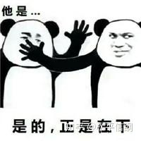
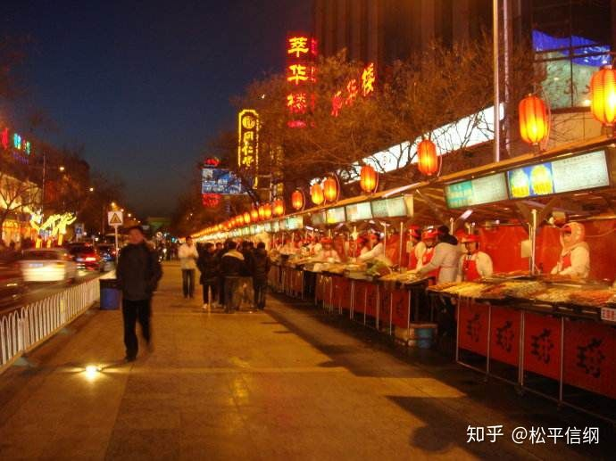

<h1>朝鲜王朝货币史（12）：黎明前的黑暗</h2>

话说上回书说到，万历朝鲜战争结束以后，朝鲜民生凋敝，加上我大明的使臣每个都是索贿能手，导致朝鲜的财政一直在崩溃的边缘徘徊。万般无奈之下，一个熟悉的声音在朝鲜人耳畔响起：“尔国不用钱，只用米布交易，故货泉不通，无以富国……”

杨镐：

当时朝鲜人对杨镐的建议是认真考虑之后果断否决的——李昖说了不止一次，铸钱之事在朝鲜断不能行。可是山穷水尽之下，就是真的不能行，也要考虑一下了。宣祖36年（1603）六月，李昖召集三品以上官员，讨论钱法。

领议政李德馨表示杨经理说得对，人家在中国身经百战，见的多了，西方的哪一套都见过，既然这么说了肯定有他的道理。至于以前的钱法失败，那是因为没有定性，朝令夕改，百姓这才不敢用钱。

左议政尹承勋则提出反对意见，表示就算铸小钱，一个也要八分重（这就很奇怪了，明明朝鲜铸一个钱需要1.25钱的铜来着……看来真的是铸造技术不过关），一万斤铜只能造两千贯钱。对于现在的朝鲜而言，两千贯钱有什么用尚不可知，一万斤铜是断断无处可寻的。

最后双方表决——同意铸钱的14人，反对铸钱的17人，建议未能通过。

说到朝鲜铸钱的重量，还有一则史料。仁祖元年（1623）清点库藏，整理出了此前铸造的一铢钱400贯，始终未曾使用，一直在吃灰。一两是十钱、二十四铢，一铢则相当于一钱（正常情况下，一个铜钱应该比一钱略重）的40%左右。看来百姓不接受这样的钱，也是有充分理由的。

仁祖年间，明朝与女真的战争日益激烈，朝鲜国防形势吃紧，加之毛文龙三不五时过来“贸易”（每年五六万两的贸易当中，朝鲜很吃亏），导致财政状况并未好转。仁祖3年（1625），户曹判书金荩国面对“大仓无数月之需”的情况，上书请行钱法。年底，仁祖下令设铸钱厅于仁庆宫，准备铸钱事宜。题外话，仁庆宫是光海君下令修建的宫殿，将其移为铸钱厅，也有削除光海君时代遗迹的因素在内。（仁祖二十五年重建昌德宫时，即将仁庆宫的大部分建筑拆除，移建于昌德宫内）

到次年六月，户曹汇报称，一共铸成了铜钱六百贯——也就是消耗了三千斤铜。此外他们发现了一个重要的问题——距离上一次用钱已经过去了快二百年的时间，“愚下之民，不知钱之为何物”，自然也就不敢用钱。为了教大家用钱，户曹建议在景福宫门口开饭店，只收铜钱，让大家拿着钱消费，这样就让人知道“原来铜钱是可以用的”，进而逐渐让百姓在各个方面都接纳铜钱。

户曹的几位大人为了教化民众，可真是辛苦了……不过笔者脑补了一下这个场景，活脱就是今天某些景区外面的“小吃街”翻版……

此后，铜钱的推广按部就班地进行着。仁祖4年（1626），下令刑曹、司宪府、汉城府的征赎皆用铜钱。当年年底，仁祖雄心勃勃地下令，自次年起，全面推行钱法。

讲个鬼故事：1627年，干支纪年丁卯。

后金大军一来，国王都跑路江华岛了，还哪有人管什么钱法；加之战乱又荼毒了一遍朝鲜北部，当年朝鲜国内大饥，于是此事又一次被搁置。

户曹再把这事想起来，是仁祖11年（1633）的事了。在当年十月的上奏当中，户曹表示，拜日本人“岁不下数万斤”的倒腾所赐，铜的来源终于解决了。仁祖12年（1634）末，终于开始在全国推行钱法。但是，依然“有用钱之名，而无用钱之实”，推广非常困难。

真正努力将钱法推向实处的，是成均馆行大司成金堉。金堉表示，行钱法不能只在汉城推广，要想真的深入人心，一定要铺开到全国各地，特别是离中国更近的“行旅络绎之地”——两西（关西平安道、海西黄海道）。金堉建议沿途的驿站改为只收铜钱，百姓“米、布、柴草纳官之物”也都改交铜钱，同时将户曹储备的铜钱分送两西，如若不够，命两西地方官购买中国的铜钱使用。六年后（孝宗元年，1650），金堉在出使清朝之后，还率先垂范，亲自买了150贯铜钱，分给平壤、安州两地使用。两国商人闻风而动，“汉人闻我国用钱，多载出来，置于辽东”，备边司表示反正造不如买，干脆从中国买钱（但是铜钱流出境外是清朝对外贸易所不允许的）——用1600两白银能买到130万枚铜钱，干脆就让燕行使团在回国之前从辽东买钱回国

题外话，辽东的“省陌”现象非常严重，上文例子中，130万枚铜钱居然有5600贯之多，每贯不到250文钱。这甚至比通行于清初东北，以“制钱三十三文为一百”的“东钱”制度还要少——可见贩钱至朝鲜，同样有着巨大利润。

可是到了推行层面，老毛病又来了。一方面，钱量不够，“受钱于常平厅者，元数不敷”；另一方面则是推行过程中的弊病，“勒令交易，鞭扑狼藉，商贾不行，怨声盈路”。尽管孝宗和金堉反复强调不能强迫，但依旧存在“令民各带钱五十，不带者有罪”之类的现象发生。最终，金堉因此遭到了巨大的舆论压力，不得不辞职；而钱法的推行也随之人亡政息。此后，一直到肃宗年间，铸钱只是偶一为之，而且更多的时候是用于赏赐，其纪念品性质大于货币性质。
