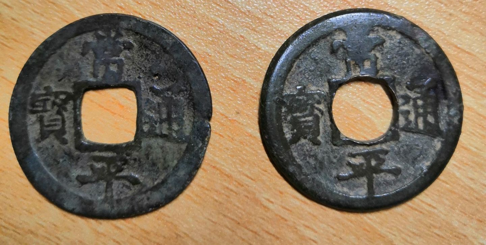
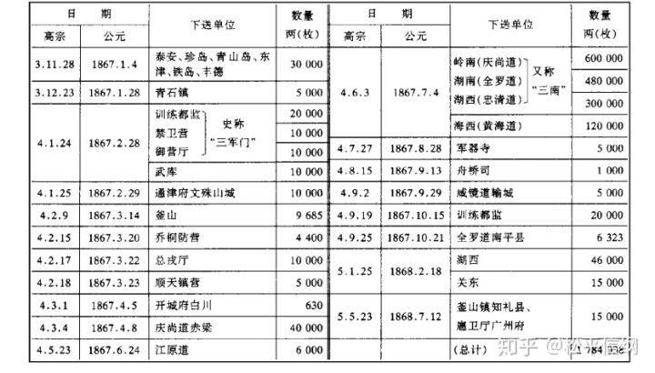
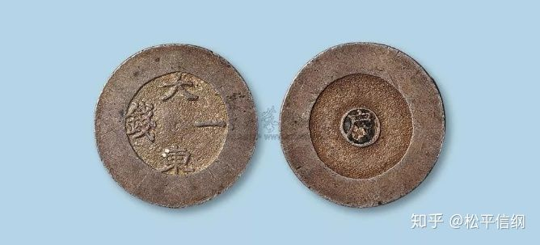
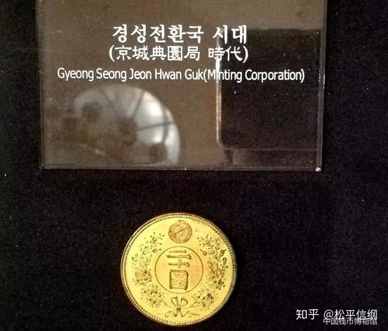
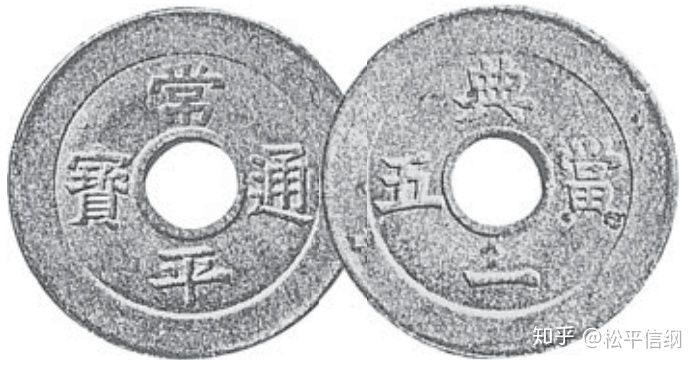
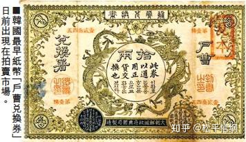
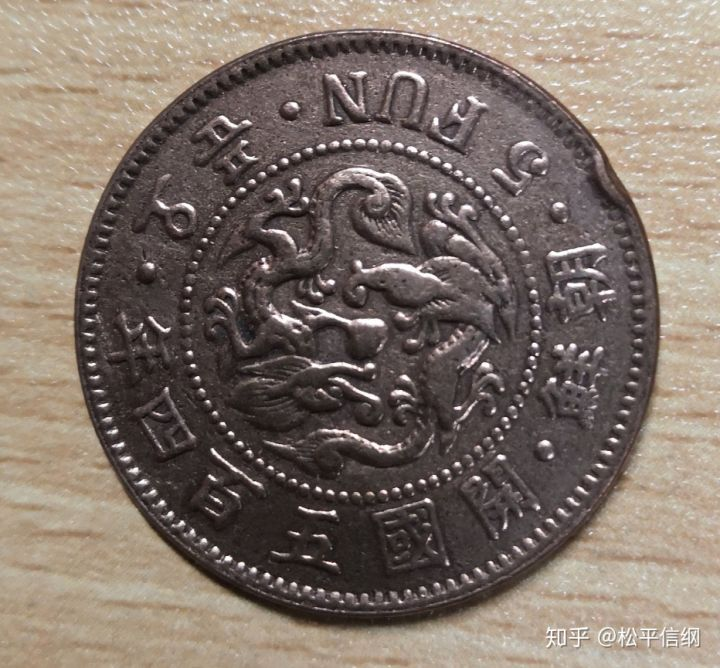
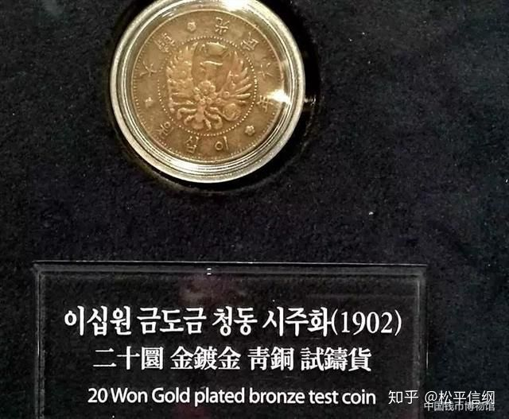
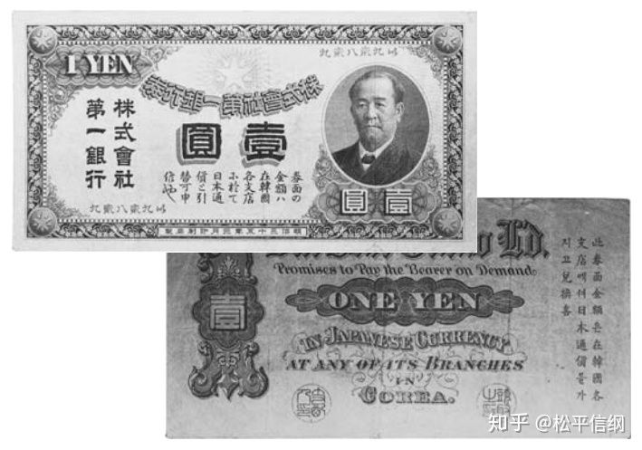
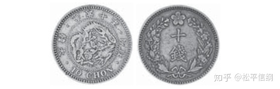

<h1>朝鲜王朝货币史（13）&（14）</h1>

时间——过得很快。

仁、孝、显快七十年只推行到了“松都旁近数邑”的钱法，终于在肃宗朝开花结果了。肃宗4年（1678），朝鲜又一次行钱法，以钱四百文当白银一两（此外，朝鲜的铜钱也可以用“两”来计数，一百文为一两，十两为一贯），禁私铸，同时鼓励和日本贸易铜铁等原材料。这一次的推行钱法出乎意料地顺利，铸造的“常平通宝”（以最开始造钱的机构常平厅为名）推行全国，除了原料依然需要进口之外（从日本进口铜，从中国进口锡），几乎没有发生什么特别大的波澜。虽然依然有着铸钱弥补财政亏空的现象，但总归拿出来的是上称历历可数的铜，而不是印着花纹的废纸，百姓还是可以接受的。

究竟为什么这一次，钱法能够这么顺利地推行呢？除了商品经济逐渐发达的需要之外，朝鲜对赋税制度的改革也是催生一种稳定货币的重要原因。在战争期间和战争后，地方政府借“官屯”之际侵夺百姓土地，宫房田（宗室受赐收税权的土地）也不断扩大，大量自耕农失去土地，国家税收日益减少。改革税制，减轻百姓压力刻不容缓。光海君时代，大臣李元翼率先提出了大同法。按旧制，朝鲜各地“随其邑产，使土民直纳京司”，收取的多为实物，且种类、数目不一，百姓遭到的盘剥极重。大同法之下，设定统一的税率，缴纳税米，除此之外的加派一律免除。朝廷需要的实物，从市场购买。这样，就在减轻了百姓负担的同时，用与一条鞭法类似的手段，将百姓强制性地推向了市场。但是正因为减轻了百姓的负担同时导致官僚地主的利益遭到了损害，这一做法的推行用了一个世纪之久，直到1708年（肃宗34年）才推行全国。

可是到了英祖朝，似乎又有了保守化的倾向。他认为世风日下、道德沦丧，跟铸钱有着密切的关系（这……）于是，他在英祖元年（1725）下令停止铸钱，把赈恤厅准备好的铸钱用铜拨给军队制造兵器。同时，英祖还下令废除原来税收中“钱木（棉布）参半”的制度，即税收中不收铜钱。折腾了大抵六七年的时间，最后英祖还是不得不承认，棍棒打不倒经济规律——“命户曹、赈恤厅，分设铸钱所”。这一时期的铸钱规模很大，获利也很多，动辄数十万两（数千万枚）的铸造和接近20%的获利，使得各部门在财用匮乏的时候，第一反应就是上书请求铸钱。也正因如此，常平通宝背后的铭文随着铸造部门的不同而不同：

中央机关：常平厅（无字）、典圜局（典）、户曹（户）、工曹（工）、兵曹（兵）、禁卫营（禁）、武卫营（武）、御营厅（营）、守御营（守）、总戎厅（捴）、训练都监（训）、经抄厅（抄）、赈恤厅（赈）等；

地方道府：开城（开、松）、江原道（江）、京畿道（京）、庆尚道（庆）、全罗道（全）、平安道（平）、咸镜道（咸）、黄海道（黄）、忠清道（忠）；

水原（水）、广州（圻）、江华岛（沁）、原州（原）、昌原（昌）、瑞川（川）、水师统制营（统）等。

由此可见，大部分中央机关的铸钱都是和军事相关的。这也从另一个方面反映出朝鲜王朝后期的财政负担，有相当一部分是来自军事的。

常平通宝背后，除了代表铸造单位的铭文，还有序号，目前可见的有用《千字文》、干支、五行作为序号的。折二钱、折五钱和折十钱在背后还有“二”、“五”、“十”的铭文。折二和折五何时开铸不详，折十钱的开铸在纯祖16年（1816），当时“以铜四钱铸一钱, 以为当十之用, 与时用小钱参用”。这一年，《会计簿》记载各司·各营所盈余的钱数为61万两，比上一年少53万两，应该是为了弥补盈余锐减的现象而铸的。

高宗继位后，大院君李昰应摄政。为了强化王权，他大兴土木，重建景福宫。这给朝鲜本不宽裕的财政带来了巨大的压力。为此他做了两件事——一是允许使用清钱，二是开铸当百钱。当百钱正面、背面铭文分别为“常平通宝”和“户大当百”，高宗3年（1866）底开铸，半年后停铸。据实录记载的数字，共铸造了178万枚，对于急需聚敛财富的朝鲜朝廷而言自然是有用的（小平钱重5-7克，当百钱重25克左右，也就是说用5钱的铜铸当百钱，可以当100钱花），但是百姓却十分不买账。虽然有政令要求一两以上的买卖必须使用当百钱，纳税也需要交纳一定比例的当百钱，但是百姓依旧宁可用旧钱甚至私钱。史载“士、农、工、商, 俱受其（当百钱）病, 转辗相仍, 百物耗损”。有意思的是，大臣们的反弹主要在于使用清朝钱币上，他们认为这是“变先王之旧章, 辜天下之彝伦”，是以夷变夏的表现。

不过随着朝鲜被逐渐打开国门，这个“夏”，也不得不变了。

<h1>朝鲜王朝货币史（14）：近代货币制度的昙花一现</h1>

1882年的朝鲜王朝实录读起来，是颇有些荒诞感的——一方面，和从前几百年一样，朝鲜在铸造着不同类型的常平通宝（包括一批当五钱）；另一方面，在领议政洪纯穆的建议下，朝鲜允许流通外国的（主要是中日两国的）“金银钱及纹钱”。在允许外国金银钱流通的同时，朝鲜铸造了第一款银币——“大东一钱”、“大东二钱”和“大东三钱”。这种钱的特点是取消了方孔，在中间的圆圈内为一“户”字，另一面书“大东X钱”四字。这是朝鲜第一种近代化的货币。

大东一钱银币

1884年，朝鲜聘请了德国人穆麟德出任典圜局总办，引进现代机械制造货币。此外，还任命前兵使安鼎玉作为机器局和典圜局的帮办，在宣惠厅的仓库中开设了典圜局的造币厂，1887年竣工。在这期间，朝鲜试制了多种钱币，包括五文和一两的锡钱和二十圜镀金锡钱。锡钱背面有三爪龙，并自称“大朝鲜”。二十圜锡钱上更是第一次以“大朝鲜开国XXX年”纪年（以1392年为大朝鲜开国元年的纪年法）。典圜局除了制造新式货币之外，也铸造“常平通宝”，只不过这一时期的常平通宝有一种圆孔的，很明显是机器打孔所成。

二十圜镀金锡币

有机制圆孔的“常平通宝”当五钱

1893年，朝鲜印制了自己的纸币“户曹兑换券”。以五十元为例，纸币正面中间为盘龙，写有中文和朝鲜文的“此券以通用正货交换也”，意即兑换券可以和硬币通用互换；四角为中文和朝鲜文的“伍拾”，下部写有“大朝鲜国政府典圜局制造”，背面以英文写有“凭券支付五十元硬币”。这也是朝鲜文第一次出现在朝鲜货币上。

户曹兑换券

到了1894年，一方面是传统货币由于以次充好实在维持不下去（大臣上疏中称当五钱和小平钱几乎可以混杂使用，可见其质量）；另一方面，货币改革也被看作是“更张”的一部分。于是高宗31年（1894）七月，朝鲜颁布了《新式货币发行章程》，正式使用新币。章程定新式货币为五等，一分（黄铜）、五分（红铜）、二钱五分（白铜）、一两、五两（银）。（1两＝10钱＝100分）正面的铭文中，有中文、英文、朝鲜文三种文字。在此之前，由于典圜局资金紧张，朝鲜政府同日本借款，购置机器在仁川设置了仁川典圜局。

开国405年（1896）红铜五分

1897年，高宗称帝，建立大韩帝国。之后铸造的货币都以年号纪元。值得一提的是，“俄馆播迁”以后，俄国势力在半岛的影响力日增，韩国受到俄日两国的共同影响。这种影响同样体现在了货币上。这一时期韩国仿照俄国货币铸造了一批硬币（大约在1901-1902年之间），正面的图案不再是传统的双龙戏珠，而是与俄国双头鹰类似的独头鹰，头戴一顶中式王冠。与此同时，1902年韩国改定币制，将货币的度量衡改为与日本类似的1圜＝100钱，定货币为七等：二十圜、十圜、五圜为金，半圜、二十钱为银，五钱为白铜，一钱为红铜，由于资金短缺，金币只有少量样本，主要铸造的是铜、银币（特别是白铜币，滥发到了没人用的地步）。除此之外，1902年以后，日本第一银行也开始在朝鲜发行纸币，纸币正面用日文、背面用汉谚混写写道“持本券可在韩国各支店兑换如票面金额的日本通货”。

二十圜金币样品（还是镀金的）

日本第一银行发行的纸币

1905年日俄战争后，日本彻底控制朝鲜半岛，1906年，货币改为九等（加银制十钱、青铜一钱、青铜半钱三种），并将货币铸造权移交给日本，在大阪铸造。

光武十年（1906）银质十钱

1910年，韩国灭亡。

<code>
以钱文年号言之，<b>废我光武，用彼明治，主客倒置</b>，国体之损，果何如也? 臣愚以为既得借款，不以纸币，以金银设法鼓铸，以金为原位货，以银为补助货，量铸得二千万圆，兑换白铜货，则矫捄之方，恐合事宜矣。  

……<b>今日陛下坐榻之外，皆敌国探报之人警察之场，则陛下所与守者何人，所与议者何人？</b>臣言念及此，蹶然而起，奋然而立，怃然而自伤。 宁效古人舁榇赴朝，碎首天陛之事，家国未破之前，愿死于陛下之庭者。 以退无可去之地，去无可死之处，故略暴梗概于疏中，随到阙下而待命。 赦其罪而纳其忠，则固臣之愿，诛之以狂言之罪，亦臣之幸也。
——韩国光武十年（1906），大臣金振鹤上疏
</code>

附：<a href="朝鲜王朝实录货币史资料辑录.docx">《朝鲜王朝货币史资料辑录》</a>
