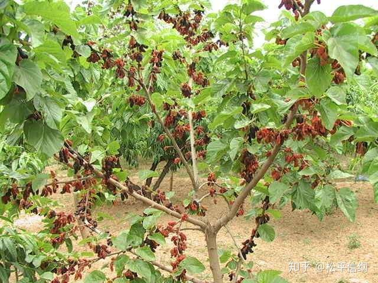
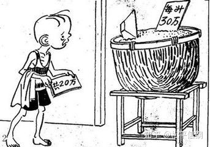
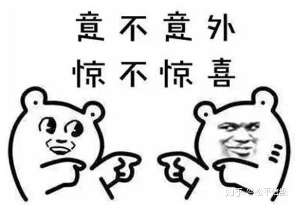

作者:<a href="zhihu.com/people/zhijiangchuan">松平信纲</a>

文章被以下专栏收录  
<a href="zhihu.com/column/kuizhangge">奎章阁</a>

<a href="zhuanlan.zhihu.com/p/76454906">个人系列文章索引</a>

<h1>朝鲜王朝货币史（1）：李芳远与朝鲜纸币</h1>

上一篇文章<a href="海东自有轻重宜：高丽王朝货币概述.md">《海东自有轻重宜：高丽王朝货币概述》</a>当中，介绍了高丽王朝曾经使用过的两种货币——**铜钱和银瓶**。很不幸，到了高丽末年，二者也没有推广开，市场上一直在用粮食和五升布凑合，《太宗实录》云“前朝货以绫罗、瓶，后世代以布货”者是也。五升布是一种粗布，《国语》韦昭注有云，“八十缕为升”，五升布就是每匹布有400缕经线。在朝鲜，11升以上的布匹都是当奢侈品禁止出口的，所以五升布在他们看来也就没那么粗糙了。但是迁延日久，奸商在布这种看似没法搞事情的一般等价物上也能玩出花样——《太宗实录》记载，高丽末年“奸伪日滋，**布自五升，转为三升**”，相当于花式贬值。

太宗大王李芳远曾经去过中国，见过世面，所以继位当年（1401）就设置了负责印钞的司赡署，打算推行钞法。朝鲜管纸币叫楮货，因为朝鲜的钞是用楮（桑树）树皮的内层纤维造的纸，故名。不过在实践中，发现各道上贡的纸质量不一，百姓专挑纸厚的用，最后户曹只能自己造纸。

最开始连朝鲜的士大夫们都不支持太宗的做法，司宪府曾经两次上书请罢司赡署，甚至建议推行使用布币（其实就是在五升布上盖戳，用国家权力给五升布背书），统统被太宗否掉了。

9个月后的太宗2年（1402）1月6日，司赡署印出了两千张楮货，据后人感慨，“初建行楮币之时，亦欲续请造小楮币，以仿华制，迁延未果”（《太宗实录》15年6月11日），也就是说，朝鲜的纸币只有一贯这一种面值。造好楮货的第二天，太宗就高兴地用纸币给大臣们开工资了——这倒是和我大明一脉相承。

桑树，桑葚就是这种树的果实

楮货的价值，依旧是和米、布挂钩的。最开始规定楮货一张（朝鲜人习惯用“张”做纸币的计量单位）折合五升布四匹，百姓都不习惯用；后来改为折合五升布一匹、米二斗（以及大明铜钱一贯）。太宗对于推行纸币也是抱有非常高的热情的，半年时间里先后五次拿出国库的布、米豆、鱼肉来，让百姓拿楮货来买，以期促进楮货的流行。顺便说一句，为了防止布又被当成钱用，国库卖出去的布都是裁成三截的。

三个月后，太宗下令市场买卖必须用一半的楮货；又过了半个月，太宗接到小报告说市场中依然不认楮货，一怒之下禁绝布匹使用。最开始，布匹流通的最后期限是5月1日，后来放宽到7月15日。

虽然大臣们自称“百姓已便之”，但是九月底秋税的征收中，太宗下令准许庆尚道本已“悉令纳租”的“紬布之田”继续使用五升布交税，可见百姓“视楮货为无用之物，日益忧疑”，最终导致“物价腾踊，未有纪极”，一张楮货连一斗米都买不到（半年多就贬值了超过50%）。兼用纸币和布匹的命令下达之后，百姓看到布匹又回来了，更加不信任纸币，导致“楮币废而不行”。太宗3年（1403）9月5日，无奈的太宗不得不下令撤销印制纸币的司瞻署，停止纸币的继续发行。

@亿万富翁我民国

但是太宗对此是不死心的。太宗10年（1410）6月8日，户曹请将建文年间所造的楮货改印永乐年号发行。这无疑是在为楮货的复活开后门——因为短短一个月后，楮货法就复活了。这一次的楮货，由户曹负责发行（旧楮货到太宗11年被废止，由司瞻署负责兑换）。最开始的政策依旧和第一次一样，准许楮货与布匹通用，但是后果也一样，“民间不用楮货，全用布”。太宗在观察了两个月之后，从9月起连下数道命令：禁止百姓使用布匹做货币，“用布者，以判旨不从论”；将此前收取税布（以布作为实物税）的地区改为征收纸币；将杂贡也改为货币税；在汉城和开京设置和卖所进行官营贸易，只准使用纸币——为了推行纸币，官员甚至派人去商贩处微服私访，谁敢还用布直接麻袋一套带走杖打，因为实在太过扰民才废止。

次年正月，为了推行楮货的措施开始更加严苛。对房屋征收房产税（一间一张楮货，使人想起唐朝的间架税）；要求百姓在房屋周围种桑树，不种罚款；将“户米”（丁税）改为用楮货缴纳；禁止私藏布匹，五百匹以上斩，五百匹以下杖一百充军。但是检查藏匿布匹的结果却是令人失望的——“搜民户，**得藏布者只十一人，皆贫乏不过数匹**”，至于这种结果你信不信……我反正是不信。

复用纸币的法令推行了一年多，弊病依旧难治——一方面由于“多散不敛”，导致“**楮货甚贱，无有以米易之者**”，朝廷不得不设置各种杂税回收楮货稳定币值；另一方面由于朝廷只在开城、汉城发放纸币，使得其使用范围始终局限在几个大城市里，“**外方买卖，专用米布，不用楮货**”，对此太宗也无可奈何，只能下令允许京城以外继续使用五升布。到了太宗16年（1416），一匹五升布的价格已经达到了五张楮货，纸币贬值到了原先的20%；世宗元年（1419），一张楮货只能买米三升，纸币价值只有原先的15%；世宗4年（1422）的情况更为糟糕，**1升米价值已经达到了3张楮货，纸币贬值到了原先的1.7%**——大明市场30年才做到的事，朝鲜仅仅十年就做到了。奈何太宗大王早已升遐，这个棘手问题，就留给了继任的世宗。
