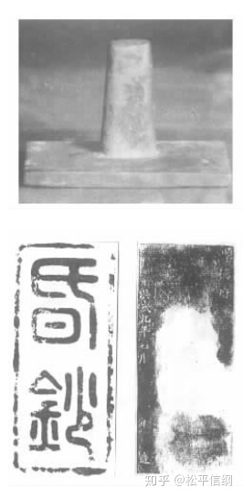
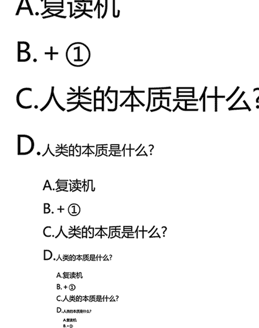

<h1>朝鲜王朝货币史（2）：元、明与朝鲜的换钞法</h1>

元代以钞为主的货币制度完全不似这个草原民族的粗犷性格，制度可谓相当严密细致。（当然王朝末季钞法崩了倒是另一个问题）由于元代有不同种类的纸钞，所以设置了行用库和平准行用库，负责兑换纸币与金银：“外路倒换金银钞，立着平准行用库；倒换钞，立着行用库”。与此同时，对于破损、字迹模糊、油污水浸的“昏烂钞”，由行用库负责兑换新钞，收取一定的手续费（每贯20文或30文铜钱）。大德二年（1288）中书省、户部下发了昏烂钞的详细兑换标准，共分25种情况。对收回的昏钞，在各省设置烧钞库，每季度烧毁一次，由行省官监督。

央行表示，在我国，个人烧毁假钞也是犯法的——所以此处配得是毛熊家的图

洪武八年（1375），明朝规定了纸币、铜钱和金银的兑换比例，即每贯钞折银1两/钱1000文，银4两折金1两。这可以标志着明代货币体系的初步完成。有人认为在这个过程中，明代统治者并没有考虑到昏烂钞的兑换问题，但是根据洪武八年三月即仿元制设立行用库来看，很可能是当时并没有出现昏烂钞问题，所以换钞法也就无从谈起。

换钞法的实施，据《明太祖实录》，事在洪武九年（1376），与元制类似，每贯昏烂钞收工墨费三十文，在钞票正面的面值下面印“昏钞”二字（1991年河北邢台出土了一方行用库所用的铜印，印文即为“昏钞”），按季度解送户部销毁。京外行用库不久后便被裁革，洪武十三年（1380）五月复置，同时再申倒钞法：“……民多缘法为奸诈，每以堪用之钞辄来易换者。自今钞虽破软而贯伯分明，非挑描、剜补者，民间贸易及官收课程，并听行使。果系贯伯昏烂，方许入库易换。工墨直则量收如旧。”可是在“每以堪用之钞辄来易换”的背景下，这一次的维持时间也不长，在京行用库不到半年即罢，京外行用库无载，想来下场大抵相似。

行用库革罢后十年左右，宝钞的昏烂问题再次迫使明朝政府有所行动，但都为时不长。洪武二十三年（1390），“出新钞”听任百姓倒换，五个月后中止；二十四年（1391）诏户部官严禁收税时挑拣钞之好恶，务必做到“字贯可验真伪，即通行无阻”；二十五年（1392）复开行用库于南京，给钞二万锭为本，维持了一年左右。永乐七年（1409）复设行用库，不过其主要目的已经从倒换昏烂钞变成了聚敛金银，至明仁宗继位后罢。明代换钞法至此，彻底崩溃。

1991年河北邢台出土的“昏钞”印，下右图铭文为“顺德府，洪武九年七月日造”

朝鲜王朝的换钞法，背景和明朝大抵相似，都是在百姓好新钞而恶破钞的情况下展开的。但是朝鲜王朝的换钞法最后只证明了一件事——棍棒打不倒经济规律。

在这之前为了让大家更好的看笑话，讲一点基础知识。宋朝规定纸币三年为一界，每界一千万贯为限，到换界之时收旧钞发新钞。理论上这是很好的政策，但是实际上……除了超发之外，还有到期不收旧钞的行为，比如宁宗曾下令11、12、13三界同时流通，引发了严重的通货膨胀。嘉定二年（1210），宋宁宗为了减少货币流通量，不得不采取强制手段，规定新旧会子兑换比例为1:2，强行贬值民众手中的旧钞，经济震荡持续三年之久。

朝鲜王朝换钞法是随着百姓在使用时用好钞、弃恶钞而导致的。这种现象古今中外都有，但是由此导致的“官吏亦择善恶”，实际上是在人为制造“良币”和“劣币”的区分（当然，直到1415年前，朝鲜造钞的纸都是各地上贡的，所以真的质量不均也有可能）。所以太宗11年（1411），下旨禁止择楮货，不管硬软厚薄一律正常使用，违者由司宪府、汉城府和刑曹纠察。

但是和明朝一样，纸币破损的现象终于使朝廷不得不展开行动——而且朝鲜钞又厚又硬，其实远不如中国钞耐用。朝鲜榆木脑袋的大臣们翻开书找成例，一下子就找到了南宋的例子（见上文）。于是他们一拍脑袋，反正都是以旧换新，我们也学南宋，两张旧楮货才能换一张新楮货吧！

这种做法的问题在于，朝鲜的“换钞”和南宋的“换钞”除了换这个动作是一样的，其他都不一样。南宋的“换钞”目的就是为了把百姓手中的旧钞贬值，这样为了回笼旧钞所发行的新钞就可以尽可能的少；而朝鲜的“换钞”的目的是单纯解决钞票破损的问题，与其他无关。放着好好的元制（哪怕是明制）不学，非要去学南宋，要么是他们蠢，要么是他们坏——想趁这个机会贬值旧钞，占百姓的便宜。

这种政策，带来的“买卖之际，拣择尤甚”的结果也就很能理解了，既然政府都规定破钞两张相当于新钞一贯，那我为什么还要拿一张破钞当一贯花？当半贯就好了嘛。所以尽管接下去的几年里朝鲜五六次重申禁止百姓拣择破钞的命令，但是始终屡禁不止。因为这本身是个矛盾的政策——一方面政府要求百姓拿一贯破钞当一贯花，一方面政府只承认一贯破钞等于半贯，除了智障没人会听政府的。

到了世宗27年（1445），百姓“喜新厌旧”的现象非但没有被消除，反而愈演愈烈。集贤殿直提学李季甸就上书称：“臣亲闻之，（楮货）字有明白，暂不疲软者为上品，价米五六升；暂至疲软者为中品，价米三四升；其疲软破毁者为下品，或直一二升，或至不直一升者，非其官之定价，其势然也，亦不可强使同之也。”而同年的朝鲜朝廷，依旧像复读机一样重复着旧钞两张换新钞一张的规定。

