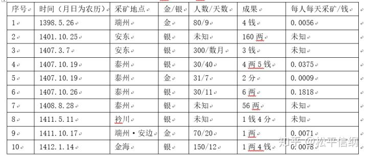
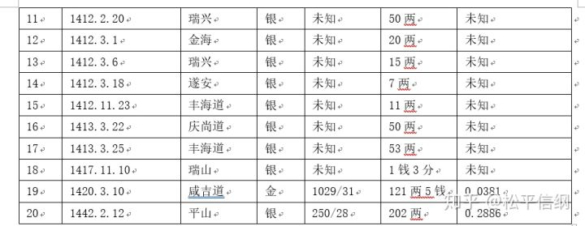

<h1>朝鲜王朝货币史（4）：朝贡金银导致的危机</h1>

丽末鲜初对明的进贡——仅1379年-1385年间，高丽向明朝的进贡就有黄金10400两、白银62000两、布匹65500匹、马7583匹（郑红英《朝鲜初期与明朝政治关系演变研究》），使得朝鲜王朝继承的是一个贵金属储量空空如也的半岛，连定宗李芳果死后发引的仪仗当中所用的金银钺都是假的。（详见：<a href="zhihu.com/question/264700639/answer/481815175">松平信纲：历史上有哪些机智巧妙的变通？</a>）也正因如此，太祖李成桂在经济上可谓毫无建树，他所做的只有前后共六次申明禁令，在“革除前朝弊政”的名义下禁止百姓、官员随意使用金银。

两边的太宗——朱棣和李芳远继位以后，双方关系逐渐缓和，在没了朱元璋把朝贡当抬杠手段的背景下，朝鲜的岁贡内容稳定在了黄金150两、白银700两。但是就算是这样的要求，朝鲜也很难实现，因为朝鲜本国（几乎）不产金银。所以，要想维持这样的贡赋，朝鲜可谓是费尽移山心力。

**1.贸易**

奇怪了，不是说朝鲜没金银么？正确的回答是，有，但不是所有地方都有。这个还有金银的地方，今天的朋友圈代购们应该比我熟悉：济州岛。可能是因为天高皇帝远，直到太宗17年（1417），济州岛百姓依然“多蓄金银”，朝廷也没有禁绝之意，而是几次派人用各种杂物（布、粮食、女装）收买金银，前后共购入了接近2000两白银。

与我们一贯认知不太相同的是，当时的日本由于矿产量有限，还没有做到白银输出，倭银打开中国和朝鲜的大门，要等到16世纪了。在《朝鲜王朝实录》中可以查到的，反而是朝鲜人冒着被处死的风险把白银卖给日本客商的记录。

**2.开采**

朝鲜王朝开采金银的尝试持续了四十年之久，但是当开采初具规模的时候，金银进贡已经被明朝废除，所以朝鲜也就没有了继续发展金银矿业的动力。比如成宗6年（1474），因为从日本商人手中买了六十五两黄金，足够一年之需，就蠲免了当年的岁贡黄金。即使是在有进贡的时候，朝鲜对于征发军人开采金银矿也没有一定的规章制度，“所采之数，多则十七两（金），少则七八两；役人或四十日，或二十日：皆无定法”，只满足于应付进贡而不做长远的打算，加上由于开矿扰民而因噎废食，使得朝鲜王朝前期的金银储备一直处在一个较低的水平上。太宗17年（1417）户曹称“本曹所储（金银），不支五六年”，也就是储备的金银只有数千两。

朝鲜银矿此时和明朝使用的应该是一样的灰吹法（中国使用灰吹法最早可以追溯到唐代，而日本使用灰吹法要晚到1530年前后从朝鲜引入技术）。《燕山君日记》燕山君9年（1503）5月18日条记载从铅中炼银的方法：“于水铁炉锅内，用猛灰作圈，片截铅铁填其中，因以破陶器四围覆之，炽炭上下以铄之”。同明代中期《菽园杂记》之记载大抵相似。

冶炼之前，先将矿石粉碎并淘洗，用火烧结，再加入米糊、铅粉（为了更好地提取银）搅拌成“窖团”，之后便是“烹银”或者叫“煎银”。将“窖团”投入炉中加热，矿石中的金属硫化物会被木炭还原成金属共熔物（一般是银和铅、锌），沉在炉底，是为“铅驼”。加热“铅驼”，再鼓入氧气将铅氧化，利用银不易被氧化的特性得到银单质，最后将其分离，得到纯银。因为最后一步的“铅驼”包裹着炭灰，又要不断吹入空气，故名“灰吹法”。

那么这种方法的效率大概如何呢？《明代银矿冶业政策及其生产经营方式简析》中举了一个官营银矿“经营不善”的反面典型（敲黑板），明朝嘉靖年间，政府派1000多名防兵开矿，一年时间开采了28500两银子，平均每人每天采银0.7916钱。如果经营得法，数字应该比这个要高很多。

笔者整理了《朝鲜王朝实录》太祖朝、太宗朝、世宗朝的20条采金银记录，如下表所示。

笔者评价这个表格中的数据，只有“目不忍视”四个字——上面的20次采矿（时间跨度达到了44年）一共才采到了黄金121两余、白银671两余。百姓由于害怕扰民，即使知道有矿也不上报，导致“莫有明言其所者”，找矿基本靠碰的情况使得朝鲜的采矿实践绝大多数时候是失败的。其中还发生过一次矿难，矿洞塌陷造成5死4伤。最后一次采银后，朝廷确定了在平山岁贡二百两白银，朝鲜的白银开采终于算是走上了正轨——尽管这样，朝鲜的人工效率还是只有明朝“经营不善”例子的1/3强。

种种证据表明，朝鲜虽然的冶炼上的技术不算落后，但是种种原因使得金银缺口很难靠采矿解决。对此，朝鲜也是心知肚明的，在太宗13年（1413）的朝天使出发前，太宗特意嘱咐翻译张永信，叫他设法打听“中原采银法”，好引进学习，提高采矿效率。

**3.搜刮**

早在朝鲜太祖时期，对于将金银贩卖出境就有“勿论钱物多少，首从皆诛”的严法。随着和中国、日本的邦交开展，打着使团旗号走私贸易的现象与日俱增；后来在朝鲜南部开三浦（盐浦、荠浦、釜山浦），准公私贸易，金银外流就更加难以禁绝了。为此，太宗在太宗5年（1405）出台禁令，使团所载行李由西北面地方官搜查，不得携带金银出境；同年10月，受贿将客商塞入使团的艺文馆提学金汉老被罢职。太宗、世宗两朝，前后八次下达禁令，严禁通过贸易的形式使金银流出，但是效果并不显着——直到二十年后的1471年，对金银外流的监管依旧“有所未至, 间有犯之者”。

百姓家是不太可能有什么金银的，于是下一步朝鲜朝廷就把目光瞄准了官员们。太宗6年（1406）确立了纳品银制度，京官一品需要献纳5两，二品4两，三品3两，外官州、府30两，开城留守50两。此外，四品以下官员的餐具以及内外命妇、宫女之外的首饰也不得用银，违禁者一律充公。到了太宗17年（1417），“外方各官酒食之器”中的银器也被政府收缴。

当然，这一问题的最终解决，还是在1429年，明朝在朝鲜的再三请求下（前两次是1409年和1420年），蠲免了朝鲜的金银贡，改贡土产，这才卸下了朝鲜的负担。
