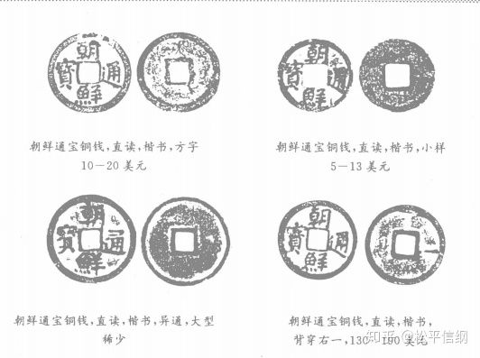

<h1>朝鲜王朝货币史（5）：世宗大王与“朝鲜通宝”</h1>

好久不写这个系列了，大家还记得之前写了什么吗？  
<a href="朝鲜王朝货币史（4.5）：“为长者折枝”.md">朝鲜王朝货币史（4.5）：“为长者折枝”</a>

书归正传。

《朝鲜王朝实录》第一次提到钱法，是**太祖3年（1394）**，户曹典书李敏道请行钱法，但是此后便没了下文。

真正试着将钱法的构思投入实际的，是太宗李芳远。太宗是一位很能“折腾”的雄主——按照传统史学家的笔法，这叫“锐思于制作”；但是在经济领域，绝大多数都是真的折腾，并没有收到其想要的结果。（详参《<a href="朝鲜王朝货币史（1）：李芳远与朝鲜纸币.md">朝鲜王朝货币史（1）：李芳远与朝鲜纸币</a>》）在钞法逐渐归于失败之后，李芳远试图乞灵于钱法。太宗15年（1415），顶着绝大多数人的反对声，朝鲜开始铸钱，文为“朝鲜通宝”，但是仅仅四天后就因为反对意见实在太多而停止。（在百姓已经不信任纸币的情况下，**铜钱和纸币并用**的结果就会是百姓一个都不信任）

世宗4年（1422），纸币实际上被朝鲜民众逐出了市场，几乎没有人再使用，所以世宗开始寻找替代的方案。有人建议坚持使用纸币，只要严刑峻法，肯定会有人用；有人建议使用布匹；有的人则提出了铸钱。次年，户曹正式开始铸钱。这是**朝鲜王朝第一次自铸铜钱，钱文“朝鲜通宝”**，书体为楷书，部分铜钱背面右侧有“一”字。

（刘文林等《朝鲜半岛钱谱》）

但是，朝鲜缺铜。户曹在世宗6年（1424）初算了一笔账，朝鲜共有30个铸钱炉，每天用铜135斤，不计损耗的话可以铸21600个铜钱，**一年需要的铜就有48060斤，这是当时朝鲜官方掌握的铜（4011斤）的十倍之多**，所以朝鲜在搜刮金银的同时，还要不断的搜刮铜。

朝鲜采取的方法是百姓每上交一斤铜器，给铜钱150个，但是这一法令后来闹出了大笑话——因为朝鲜150个铜钱的重量比一斤（160钱）还重，这么做是个赔本买卖，后来无奈，改为每一斤铜器换130钱。根据户曹的报告，铸“朝鲜通宝”钱4578贯用了铜35765斤，**每个需要耗铜1.25钱**；《明神宗实录》万历33年（1605）7月24日条称，“每铜一斤铸钱百四十文”，即铸一个钱耗铜1.14钱。至于朝鲜的这种做法是古人“不爱铜不惜工”以敌私铸之意还是真的技术不过关，从实录中提到**铸钱轻重不一**来看，很可能是后者。

朝鲜还把目标瞄准了寺庙，庆尚、全罗两道的铸钱所基本上是在靠“寺社铸铜器皿”做为原料。和白银一样，朝鲜也推出了按品纳铜的制度，从京官到地方官，从一品到九品，甚至“馆丞、万户、千户、盐场官、各从散官”，一个也跑不了。半年时间，朝鲜就搜刮了五万多斤铜。到世宗7年（1425），朝鲜铸钱共27000贯；世宗9年（1427）这一数字为40000贯。

和纸币一样，短时间内的大量投入，使得铜钱的贬值很快——仅仅两年，就从“木绵一匹直铜钱二百余文”变成了“一匹三百文或四百文”，甚至还有六七百文一匹的说法。世宗9年（1427），“升米至七八钱”；到了世宗11年（1429），“米一升直钱十二三文”。世宗自己也感慨说，钱价只有靠宏观调控才能维持住，“**行和卖之时，钱价稍高，民颇用之；和卖尽后，钱之不用，又如前日**”。

朝鲜通宝面临的另一个问题，就是铜产量。朝鲜缺铜，世宗曾几次感慨说铜“非本国所产”（关于朝鲜铜的一个很重要的来源——日本，我们以后会谈到的），为了筹措铸钱所需的铜，也是费尽移山心力（上次用到这个词是《<a href="朝鲜王朝货币史（4）：朝贡金银导致的危机.md">朝鲜王朝货币史（4）：朝贡金银导致的危机</a>》）。为了维系铸钱，后来所铸造的钱逐渐变轻，以至于“**一文之重, 只八分云**”。世宗20年（1438），面对着百姓经常把铜钱熔铸成铜器或者干脆卖给缺钱的日本人这种只出不进的现象，世宗尝试推行铁钱，但是讨论后没有下文。

最终解决这一问题的办法，是在世宗27年（1445），下令恢复了纸币的使用，并在一部分领域规定只用纸币。后来由于停止了铸钱，纸币和布匹（没错就是布匹，阴魂不散的它又回来了）逐渐占据了主导地位，1460年颁布的《经国大典》干脆规定“**国币分三等，五升布为上等，三升布为中等，楮货为下等**”，铜钱则几乎只见于朝鲜对外交往中，作为与琉球、日本等国的国礼了。
