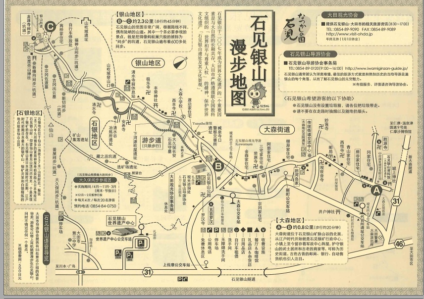
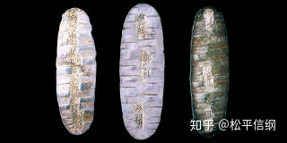
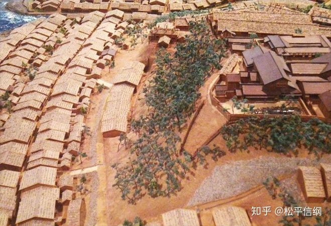

<h1>朝鲜王朝货币史（9）：东亚“白银之路”</h1>

公元1526年，大明嘉靖5年，朝鲜中宗21年，日本大永6年。这一年，发生了一件对于东亚影响深远的事情——大内义兴（朝鲜史料称之为“新介”）的家臣三岛清右卫门发现了石见银矿，这个极盛时占到全球银产量1/3、一直开采到上世纪20年代的银矿。此后，日本各大名都越来越重视矿业开采，一条从日本经过朝鲜通向中国的白银之路，在东亚的海域缓缓铺开。

石见出产的白银

有证据表明，中国是中日韩三国中使用灰吹法（详见<a href="朝鲜王朝货币史（4）：朝贡金银导致的危机.md">朝鲜王朝货币史（4）：朝贡金银导致的危机</a>）炼银最早的国家，而朝鲜次之。1533年，日本商人神谷寿贞协助大内义兴的儿子义隆招徕了会用灰吹法的工匠，从此银矿的产量突飞猛进。这一技术究竟来自中国还是朝鲜，我们不得而知，但是关于朝鲜和日本之间的采矿技术交流，《朝鲜王朝实录》中还是有蛛丝马迹可寻的。中宗34年（1539），朝鲜全州判官柳绪宗走私案发。经过调查发现，他不仅仅勾结京中商人走私白银入境，还偷偷将采银技术传授给日本人。为了掩人耳目，炼银就在他家中进行。

对于日本突然间变成了白银出口大国，朝鲜的消息是非常灵通的——因为这里是日本出口贸易的最近目的地。此前，日本出口到朝鲜的金属主要是铜，还有部分“金、银、龙脑等物”。但是从16世纪30年代起，白银占的比重越来越大，数量也越来越多。1538年，大内氏遣使带来白银5000余两，折布480同（24000匹）。朝鲜官员谈及此事就感叹说，“近来倭人只持银两，而不持他物”。虽然朝鲜再三宣谕日本商人要求其不要带银来朝贸易，但是出于“怀柔远人”的考虑，对于日商的贸易要求，朝鲜还是会尽量满足的。

朝鲜第一次了解到日本银山的存在，是中宗37年（1542）。是年，日本使臣安心东堂携带国书访朝（由于“日本国王之印”在大内氏手中，所以携带了“国书”的安心东堂应为大内氏使臣），其中对于金银开发的自豪之情溢于言表：“我（日本）北陆有山，其名曰金山，近年产于真银，实季世之伟珍也。故往岁以之献于大明，大明嘉悦。”这里说的“金山”可能是越后国边界的鸣海金山，而非更著名的佐渡金山——后者的开发要晚到17世纪初。而“献于大明”也似非无据可凭，1539、1540两年都有日本使臣来华。安心东堂此来，还携带了8万两白银、20万斤硫磺等物，请求贸易。按照官价，这相当于9000同（45万匹）布，朝鲜一时筹措无力，所以双方反复争论。最后朝鲜用1200同棉布（棉布一匹合五升布二匹，即相当于48000匹布）买了20000两白银，稍高于市价，以安日本使臣之心。剩余的货物，准许日本使臣私贸。私贸开展得如火如荼，相比于公贸，“私贸倍之，积如丘山”，日本使臣用白银“尽易京商白丝、缎子等轻物而去”。此后，日本使臣又在1556、1563、1568年三次携带大量白银来朝贸易，每次都堪称满载而归。

江户时代的日本矿山

从此以后，日朝之间的贸易得到了极大的发展，两国间通过三浦商人的贸易“肆行贸买，不可纪极”。中日两国海商（也可以说是海盗）也开始将日本白银转卖到中国，“日本国银子多产，故上国之人，交通往来贩贸”，时有因风向原因漂流到朝鲜海岸的中国人和日本人。

这些日本白银中的另一部分则通过燕行使流入中国，每次使团夹带都以万两计，不携银者百不存一，以至于大明礼部主事宋维元特意耳提面命朝鲜使臣，称“圣节（嘉靖生日）、千秋（庄敬太子生日）两行次，多用银两，牙人争利，多有害事。”沿途百姓对于朝鲜使团打着国家使臣旗号的逐利行为颇为不齿，斥之为“贾胡”（即做买卖的胡人）。有的使团成员和商人勾结，商人负责从日本人手中收购银两，使团成员则携银入京购买“唐物”回国销售；有的使团成员受“诸宫权贵之家”委托，代为购求珍玩；还有的人干脆直接和日本商人合作，比如通事金世亨，为了获取白银而携带生丝“潜入海岛”和日本人交易，最后事发被捕。

这条穿越东亚三国的贸易网络导致的结果，就是日本白银通过各种渠道大量流入中国，连朝鲜人都感叹“倭银流布，冒禁挟持，贩鬻北京者，倍万于前”，“银两日布于中国”云云，即其明证。虽然如此，白银却依然没有在朝鲜人心中树立起货币的地位。
