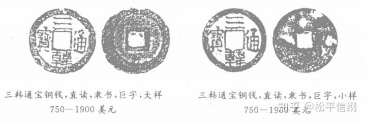

<h1>海东自有轻重宜：高丽王朝货币概述</h1>

【题图：据信是高丽王朝第一种自造货币“乾元重宝·东国”钱的彩图，图源：赵承《乾元重宝·东国钱是高丽钱吗》】

古代朝鲜半岛的货币史可以追溯到传说中的箕子朝鲜，但是有实物可考的货币制造，从高丽王朝开始。

相传商末，帝辛（纣王）的叔叔箕子奔朝鲜，立“八条之教”，其中就有奴婢出“五十万”即可自赎的规定，但是不知单位。南宋洪遵的《泉志》和朝鲜王朝时代的《海东绎史》（后者很可能是隐括前者成文）都记载了统一新罗时期的金银币。另外《泉志》中还记载了东沃沮国（约公元前2世纪到约公元5世纪）的无文钱，但是考虑到《三国志》和《后汉书》中均无此记载，而称朝鲜半岛的弁韩依然以铁为一般等价物，这种说法的可靠性存疑。

高丽王朝时代的自造货币主要有两大类，**铜钱和银瓶**。

高丽成宗十五年（996）夏，高丽第一次“铸铁钱”。根据日本收藏家奥平昌洪的考证，该钱即是在朝鲜开城的古坟中出土的“乾元重宝·东国”钱，是仿造唐朝的**“乾元重宝”钱**所铸造，钱为铁质，钱文直读（即四个字的阅读顺序是上、下、右、左），背后有“东国”二字。不过也有说法认为该钱不是高丽所造，而是渤海国所造（详参赵承《乾元重宝·东国钱是高丽钱吗》一文）。不管“乾元重宝·东国”是不是《高丽史》说的“铁钱”，这是高丽第一次自铸货币，可以说是无疑问的。不过，直到一个世纪后，高丽肃宗谈及钱法的时候，依旧在说“东方独未之行”，看来这一次即使有铸钱，也应是试铸性质，流通并不广。

图1：奥平昌洪《东亚钱志》卷十五

高丽肃宗二年（1097），肃宗设置铸钱官，七年（1102）十二月，肃宗下制书推行钱法。其中引“西、北两朝”（即宋、辽）推行钱法利国利民的例子，证明钱法势在必行。同时，还将一万五千贯（若是足陌则有**1500万枚**，按77文一陌的“省陌”计算也有1155万枚之多）分赐百官、军人，钱文为**“海东通宝”**。该钱实物存量较大，由于钱文的直读、旋读（即四个字的阅读顺序是顺时针）以及书法的楷、行、篆、隶（八分书）不同，导致现存的“海东通宝”有很多种。

图2：刘文林等编著的《朝鲜半岛钱谱》中收录了30余种不同的“海东通宝”钱

根据《宋史》记载，与此同时高丽还有“海东重宝”和“三韩通宝”两种钱；另据华光普编著的《越南、朝鲜、日本古钱目录》，高丽还有一种“海东元宝”。

图3：《朝鲜半岛钱谱》之“三韩通宝”（“大样”和“小样”指由于铸造工艺问题，同一批铸出的铜钱大小不一，大者称之“大样”，小者称之“小样”）

图4：《朝鲜半岛钱谱》之“海东重宝”

图5：《越南、朝鲜、日本古钱目录》之“海东元宝”

图6：丁福保《历代古钱图说》中的“三韩通宝”，注意下面那枚标价三百元大洋的，钱文为“弎韓通寶”，“弎”即俗体的“叁”，比较罕见

但是这么多种铜钱都没有将高丽王朝的经济成功带入货币化，北宋宣和六年（1124）出使高丽的徐兢在其《宣和奉使高丽图经》中，所见到的高丽是这样的：“男女老幼官吏工伎，各以其所有用以交易，**无泉货之法**，惟紵布、银瓶以准其值”，可见钱法不行。到了恭愍王五年（1355），高丽众臣对于自己的国家究竟造过什么钱，甚至要依据其“载之于中国传籍”的记录来考证了，而且还出了错——《高丽史》节选的这份奏疏中，衍出了一种无据可考的“东海通宝”，很可能是“海东通宝”之误。

银瓶，是高丽王朝铸造的一种独一无二的银质货币。韩国《东亚日报》曾经将其称为“韩国最早的货币”，这虽然并不符合事实（不学如大韩），但是银瓶的存在确实是古代东亚货币史上的一颗沧海遗珠，存世量极少。

图7：藏于首尔韩国银行货币博物馆当中的高丽小银瓶。
<a href="htt://blog.naver.com/worldrealtor/120147958016">图片来源：转引自李好、毛致周《造型独特的朝鲜古币银瓶》</a>

**银瓶，又名“阔口”**（据称是因为其上端的开口而得名），始铸于高丽肃宗六年（1101），据称造成葫芦瓶形是为了<b>“象本国地形”</b>，但是其形状很明显和朝鲜半岛有很大差别。所以，究竟为什么铸造的是“瓶”成了一个不解之谜。这一次铸造的银瓶非常大，每个<b>重一斤，用纯银制</b>，所以其购买力也非常惊人，即使成色不断下降，在忠肃王十五年（1328）依然能够“折综布十匹”，而高丽百姓“家蓄一匹布者尚寡”。这也导致了日常生活基本上与银瓶无缘，银瓶只出现在大宗贸易和进贡、赏赐等情况下。

忠惠王元年（1339），为了应对大银瓶的诸多不便和私铸带来的币值下跌，高丽改铸**小银瓶**（每个小银瓶折布十五匹，但重量不知），但小银瓶到14世纪末也落得个“俱废不行”的结果。

究其原因，大抵有三个方面：

**1.价值太高**  
正如上文所言，每个银瓶折布十几匹，所以几乎和普通百姓绝缘，不可能被市场认定为一般等价物。同时官方数次以行政手段规定价值，这种“劣币驱逐良币”的做法，也影响了正常的流通。

**2.私铸和掺伪**  
忠肃王十五年（1328）记载，“上品瓶，折综布十匹；贴瓶，折布八九匹”。“贴瓶”指的就是**民间私铸**的银瓶。可以想见，私铸瓶必然会在其中掺入其他金属（比如铜）来获利，这就导致了后期银瓶的价值日益下降，信誉也日益受损。

**3.用途上的原因**  
史载“凡交际赏赐皆用”银瓶，同时高丽还多次向元朝进贡银瓶作为国礼，向寺庙布施银瓶作为对佛的供品，这就导致大量的银瓶并没有流入市场。

到了朝鲜王朝时期，由于向明朝进贡需要金银，而朝鲜本身的金银储备又不多，产量更是可怜（太宗12年，全国开采白银的数量合计为104两，才相当于区区6个银瓶），于是便废弃了以白银作为货币的想法。
